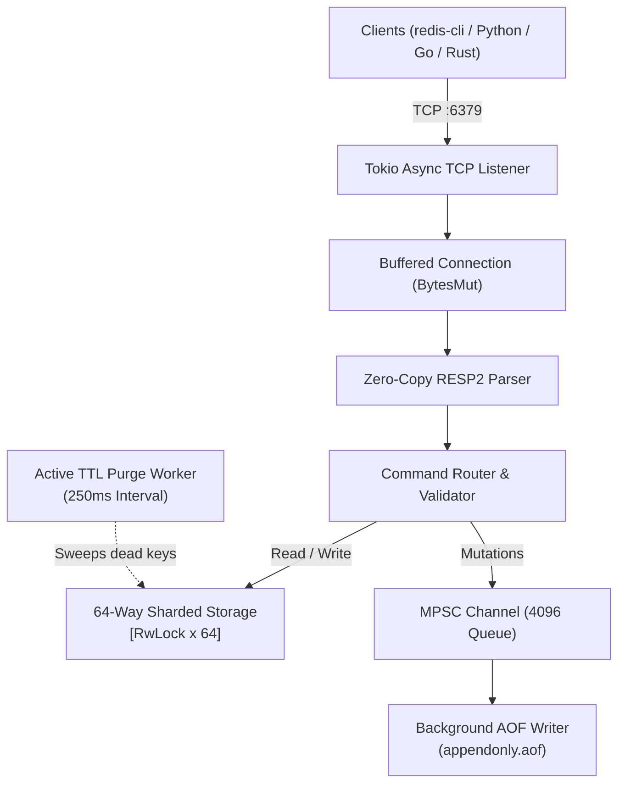

# FerriteKV

A lightweight, concurrent in-memory key-value database written in Rust, wire-compatible with Redis (RESP2 protocol).

Built to experiment with zero-copy stream parsing, measure `RwLock` contention across 64 shards under heavy concurrent writes, and implement non-blocking AOF persistence on top of Tokio primitives.

---

## Architecture & Implementation



* **Zero-copy RESP2 parser:** Streaming frame parser using `bytes::BytesMut`. Handles partial TCP frames and buffer slicing without reallocations.
* **64-way sharded storage:** Eliminates a single global lock bottleneck. Keys are hashed across 64 independent `std::sync::RwLock<HashMap<String, Entry>>` buckets.
* **Dual-tier TTL expiration:**
  * *Lazy expiration:* Expired keys are discarded on access.
  * *Active expiration:* Background async task periodically inspects shards to reclaim memory.
* **Non-blocking AOF durability:** Write mutations (`SET`, `DEL`, `INCR`, `EXPIRE`, etc.) are queued over a non-blocking `tokio::sync::mpsc` channel and written sequentially to disk in a dedicated background task.
* **Minimal dependencies:** Only core async primitives (`tokio`, `bytes`, `tracing`). No heavy frameworks or extraneous crates.

---

## Benchmarks & Stress Testing

Tested on localhost running 100 concurrent worker tasks executing 1,000,000 mixed operations:
* 30% persistent `SET`
* 30% high-frequency TTL storm (`PX 100ms - 300ms`)
* 20% concurrent `GET`
* 20% high-contention atomic `INCR` on shared hot keys

| Metric | Result |
| :--- | :--- |
| **Total Operations** | **1,000,000** |
| **Concurrency** | **100 active connections** |
| **Total Time** | **17.50 seconds** |
| **Sustained Throughput** | **57,116 ops/sec** (peaks ~79,000 ops/sec) |
| **Average Round-Trip Latency** | **1.75 ms** |
| **AOF Log Generated** | **54.55 MB** |
| **AOF State Recovery Time** | **0.49 seconds** (500k commands replayed) |
| **Dropped / Failed Ops** | **0 (0.00%)** |

To run the 1,000,000 operations test yourself:
```bash
# 1. Start FerriteKV with AOF enabled
cargo run --release -- --port 6399 --aof stress.aof

# 2. In another terminal, run the stress test (port, total_ops, concurrency)
cargo run --release --example stress_test -- 6399 1000000 100
```

---

## Supported Commands

| Category | Commands | Description |
| :--- | :--- | :--- |
| **Connection & Meta** | `PING [msg]`, `ECHO msg`, `INFO`, `COMMAND`, `SELECT`, `CLIENT`, `QUIT` | Health-check, handshake, telemetry |
| **Strings** | `GET key`, `SET key val [EX s] [PX ms]`, `MGET k1 k2...`, `MSET k1 v1...` | Read, write, batch operations |
| **Counters** | `INCR key`, `DECR key`, `INCRBY key delta`, `DECRBY key delta` | 64-bit atomic integer arithmetic |
| **Lifecycle** | `DEL key...`, `EXISTS key...`, `EXPIRE key secs`, `TTL key`, `DBSIZE`, `FLUSHDB` | Key management, TTL inspection, flush |

---

## Quick Start

### Build and Run

Requires Rust 1.85+ (2024 Edition).

```bash
git clone https://github.com/s3lfcoded/ferrite-kv.git
cd ferrite-kv

# Run test suite
cargo test --all-targets

# Start server on default port 6379
cargo run --release

# Or with AOF enabled on a custom port
cargo run --release -- --port 6379 --aof appendonly.aof
```

### Connect with `redis-cli`

```bash
$ redis-cli -p 6379
127.0.0.1:6379> PING
PONG
127.0.0.1:6379> SET framework "Rust" EX 120
OK
127.0.0.1:6379> GET framework
"Rust"
127.0.0.1:6379> TTL framework
(integer) 118
127.0.0.1:6379> INCR visits
(integer) 1
127.0.0.1:6379> DBSIZE
(integer) 2
```

### Python Example (`redis-py`)

```python
import redis

r = redis.Redis(host="localhost", port=6379, decode_responses=True)
r.set("user:100", "Alice", ex=60)
print(r.get("user:100"))  # Alice
print(r.ttl("user:100"))  # 60
```

### Docker

```bash
docker build -t ferrite-kv .
docker run -d -p 6379:6379 --name ferrite ferrite-kv
```

---

## License

MIT License. See [LICENSE](LICENSE) for details.
