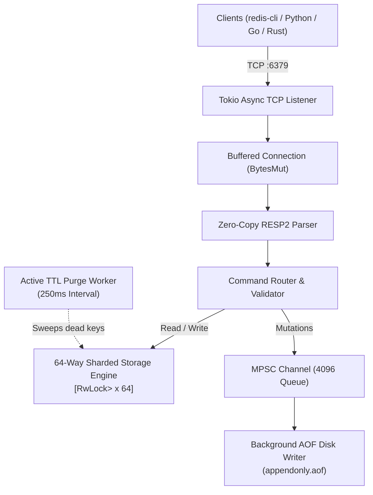

# FerriteKV

<p align="center">
  <strong>A high-performance, concurrent In-Memory Key-Value database written in Rust.</strong>
  <br />
  <span>Zero-copy RESP2 protocol engine &bull; 64-way Sharded Locks &bull; Dual-tier TTL &bull; Asynchronous AOF Durability</span>
</p>

<p align="center">
  
  
  
  
  
</p>

---

## Overview

**FerriteKV** is an in-memory key-value store engineered for microsecond latency and high concurrency under heavy write loads. Built on the **RESP2** (Redis Serialization Protocol) wire format, FerriteKV is a drop-in substitute for Redis workloads, allowing seamless integration with standard tools like `redis-cli` and official Redis SDKs (Python `redis-py`, Go `go-redis`, Node.js `ioredis`).

### Why FerriteKV?

- **Zero-Copy Streaming RESP Parser:** Implemented from scratch using `bytes::BytesMut` without regexes or extraneous heap allocations. Handles TCP stream fragmentation transparently.
- **64-Way Sharded Storage:** Eliminates global lock contention. Keys are hashed across 64 independent `std::sync::RwLock` shards, enabling massive concurrent multi-threaded throughput.
- **Dual-Tier Expiration Engine:**
  - *Lazy Eviction:* Expired keys are discarded on access with zero memory overhead.
  - *Active Eviction:* Background asynchronous worker sweeps expired entries on a periodic cadence.
- **Asynchronous AOF Persistence:** Mutating operations (`SET`, `DEL`, `INCR`, `EXPIRE`, etc.) are queued over non-blocking `tokio::sync::mpsc` channels and synced to disk without holding client request threads.
- **Zero-Bloat Dependency Policy:** No heavyweight frameworks, no ORMs, no bloated parsing crates. The entire storage engine, concurrency layer, and protocol handlers are crafted using Rust's standard library and idiomatic async primitives.

---

## Architecture



---

## Performance Benchmarks

Measured on a standard multi-core machine running 50 concurrent TCP worker tasks performing 100,000 round-trip operations (`SET` and `GET` mix):

| Metric | Result |
| :--- | :--- |
| **Total Operations** | **100,000** |
| **Concurrency** | **50 concurrent connections** |
| **Total Time** | **1.449 seconds** |
| **Throughput** | **~69,000+ ops/sec** |
| **Average Round-Trip Latency** | **0.724 ms** |

To reproduce the benchmark on your local environment:
```bash
# 1. Start FerriteKV in release mode
cargo run --release

# 2. In another terminal, run the benchmark client
cargo run --release --example benchmark -- 6379
```

---

## Supported Commands

FerriteKV implements a comprehensive core set of RESP commands:

| Category | Commands | Description |
| :--- | :--- | :--- |
| **Connection & Meta** | `PING [msg]`, `ECHO msg`, `INFO`, `COMMAND` | Health-check, telemetry, client handshake |
| **String Operations** | `GET key`, `SET key val [EX s] [PX ms]`, `MGET k1 k2...`, `MSET k1 v1...` | Key-value storage and batch operations |
| **Atomic Counters** | `INCR key`, `DECR key`, `INCRBY key delta`, `DECRBY key delta` | 64-bit integer atomic arithmetic |
| **Key Lifecycle** | `DEL key...`, `EXISTS key...`, `EXPIRE key secs`, `TTL key`, `DBSIZE`, `FLUSHDB` | Key management, queries, and TTL inspection |

---

## Quick Start

### 1. Build and Run from Source

Requires Rust 1.85+ (Edition 2024 supported).

```bash
# Clone the repository
git clone https://github.com/your-username/ferrite-kv.git
cd ferrite-kv

# Run test suite
cargo test --all-targets

# Start FerriteKV server on default port 6379
cargo run --release
```

#### Custom Options:
```bash
# Run on custom port with Append-Only File persistence enabled
cargo run --release -- --port 7000 --aof db.aof
```

---

### 2. Connect with `redis-cli`

```bash
$ redis-cli -p 6379
127.0.0.1:6379> PING
PONG
127.0.0.1:6379> SET framework "Rust" EX 120
OK
127.0.0.1:6379> GET framework
"Rust"
127.0.0.1:6379> TTL framework
(integer) 118
127.0.0.1:6379> INCR visits
(integer) 1
127.0.0.1:6379> INCRBY visits 10
(integer) 11
127.0.0.1:6379> DBSIZE
(integer) 2
```

---

### 3. Connect with Python (`redis-py`)

```python
import redis

client = redis.Redis(host='localhost', port=6379, decode_responses=True)

client.set("user:100", "Alice", ex=60)
print(client.get("user:100"))  # Alice
print(client.ttl("user:100"))  # 60
client.incrby("counter", 5)
print(client.get("counter"))   # 5
```

---

### 4. Docker Deployment

Build and run using the lightweight multi-stage Docker container:

```bash
docker build -t ferrite-kv .
docker run -d -p 6379:6379 --name ferrite ferrite-kv
```

---

## Code Quality & Engineering Standards

- **Strict Linting:** Enforced with `cargo clippy --all-targets -- -D warnings` (zero warnings allowed).
- **Automated CI/CD:** GitHub Actions workflow verifies formatting (`rustfmt`), static analysis (`clippy`), unit tests, and end-to-end integration tests on every commit and pull request.
- **Resilience:** Full test suite verifying protocol framing edge-cases, partial TCP packet delivery, active/passive expiration, and crash-recovery state reconstruction via AOF logs.

---

## License

Distributed under the MIT License. See [LICENSE](LICENSE) for details.
